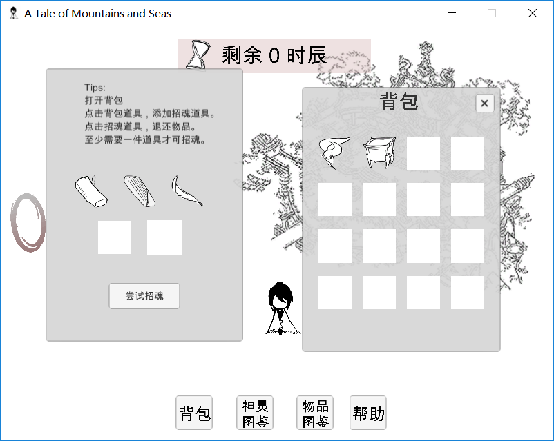

# 山海异志

## 简介
游戏名《山海异志》，是以《山海经》为背景的冒险类多周目游戏，基于Unity开发。

## 下载和安装

在``Game``目录下下载`山海异志.rar`，解压后双击 `A Tale of Mountains and Seas.exe` 进入游戏

## 玩法介绍

你，是独龙族的少族长，在一场灾难中，你的族长母亲意外离世。

人拥有两个灵魂，“卜拉”（生魂）和“阿细”（亡魂）。母亲的生魂还停留在世间，只停留12个时辰，你踏上了寻求神物，将母亲的灵魂换回的征途。

你需要用鼠标点击的方式操纵主人公，在主地图中探索各个地点，在12个时辰之内，完成某些NPC的挑战任务，获取不同的道具，以达成复活母亲的最终目的。12个时辰用尽后，你会被强制传送回

注意，不同NPC给的道具组合会解锁不同的结局，你可以多周目探索游戏。

使用键位：鼠标左键 + WASD + 空格

## 游戏界面展示

